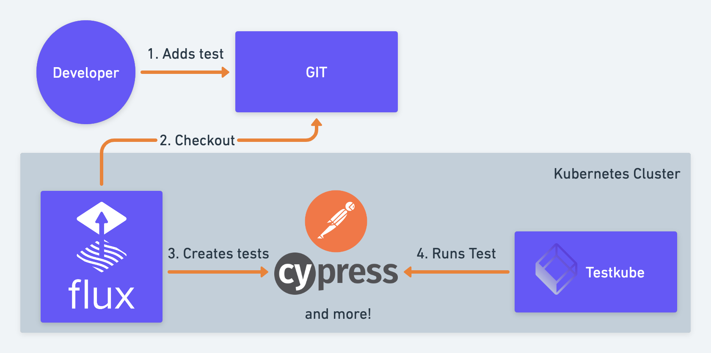

# GitOps Testing with Flux

Tools like Flux are used to do the heavy lifting of keeping your Kubernetes cluster in sync with your Git repository; as soon as a difference is detected between Git and your cluster it is deployed to ensure that your repository is the source-of-truth for your runtime environment.

## Benefits of the GitOps Approach

- Since your tests are included in the state of your cluster you are always able to validate that your application components/services work as required.
- Since tests are executed from inside your cluster there is no need to expose services under test externally purely for the purpose of being able to test them.
- Tests in your cluster are always in sync with the external tooling used for authoring
- Test execution is not strictly tied to CI but can also be triggered manually for ad-hoc validations or via internal triggers (Kubernetes events)
- You can leverage all your existing test automation assets from Postman, or Cypress (even for end-to-end testing), or … through executor plugins.

Conceptually, this can be illustrated as follows:




## Tutorial

The following is a step-by-step walkthrough to test the automated application deployment and execution of Postman collections in a local Kind cluster.

Let’s start with setting things up for our GitOps-powered testing machine!

### 1. [Fork the example repository](https://github.com/kubeshop/testkube-flux/fork) and clone it locally.

```sh
git clone https://github.com/$GITHUB_USER/testkube-flux.git
```

### 2. Start a Kubernetes cluster.

You can use Minikube, Kind or any managed cluster with a cloud provider (EKS, GKE, etc). In this example we're using [Kind](https://kind.sigs.k8s.io/).

```sh
kind create cluster
```

### 3. Create a Github Classic Token.

Must be of type [Classic](https://docs.github.com/en/authentication/keeping-your-account-and-data-secure/creating-a-personal-access-token#creating-a-personal-access-token-classic) (i.e. starts with ghp\_).

```sh
GITHUB_TOKEN=<ghp_>
GITHUB_USER=<username>
```

And export the environment variables in your terminal.

### 4. Install Flux in the cluster and connect it to the repository.

Install the [Flux CLI](https://fluxcd.io/flux/installation/) and run:

```sh
flux bootstrap github \
--owner=$GITHUB_USER \
--repository=testkube-flux \
--path=cluster \
--personal
```

### 5. Create a Flux Source and a Kustomize Controller.

The following command will create a Flux source to tell Flux to apply changes that are created in your repository:

```sh
flux create source git testkube-tests \
--url=https://github.com/$GITHUB_USER/testkube-flux \
--branch=main \
--interval=30s \
--export > ./cluster/flux-system/sources/testkube-tests/test-source.yaml
```

And now create a Flux Kustomize Controller to apply the Testkube Test CRDs in the cluser using [Kustomize](https://kubernetes.io/docs/tasks/manage-kubernetes-objects/kustomization/):

```sh
flux create kustomization testkube-test \
--target-namespace=testkube \
--source=testkube-tests \
--path="cluster/testkube" \
--prune=true \
--interval=30s \
--export > ./cluster/flux-system/sources/testkube-tests/testkube-kustomization.yaml
```

### 6. Install Testkube in the cluster.

If you don't have the Testkube CLI, follow the instructions [here](./install-cli) to install it.

Run the following command to install Testkube and its components in the cluster:

```sh
testkube install
```

### 7. Create a Test CRD with Testkube CLI.

In this example, the test being used is a Postman test, which you can find in **/img/server/tests/postman-collection.json**.

To create a Kubernetes CRD for the test, run:

```sh
testkube generate tests-crds img/server/tests/postman-collection.json > cluster/testkube/server-postman-test.yaml
```

Note: You can [run Testkube from your CI/CD pipeline](./cicd-overview.md) if you want to automate the creation of the Test CRDs.

### 8. Add the generated test to the Kustomize file.

The name of the test file created in the previous step is **server-postman-test.yaml**. Add that to the Kustomize file located in `cluster/testkube/kustomization.yaml`:

```diff
apiVersion: kustomize.config.k8s.io/v1beta1
kind: Kustomization
resources:
+ - server-postman-test.yaml
```

### 9. Push all the changes to your repository.

```sh
git pull origin main
git add -A &amp;&amp; git commit -m "Configure Testkube tests"
git push
```

### 10. Your tests should be applied in the cluster.

To see if Flux detected your changes run:

```sh
flux get kustomizations --watch
```

And to ensure that the test has been created run:

```sh
testkube get test
```

```sh title="Expected output:"
| NAME                    | TYPE               | CREATED                       | LABELS                                         |
| ----------------------- | ------------------ | ----------------------------- | ---------------------------------------------- |
| postman-collection-test | postman/collection | 2023-01-30 18:04:13 +0000 UTC | kustomize.toolkit.fluxcd.io/name=testkube-test |
|                         |                    |                               | kustomize.toolkit.fluxcd.io/name=testkube-test |
```

### 11. Run your tests.

Now that you have deployed your tests in a GitOps fashion to the cluster, you can use Testkube to run the tests for you through multiple ways:

- Using the Testkube CLI.
- Using the Testkube Dashboard.
- Running Testkube CLI from a CI/CD pipeline.

We'll use the Testkube CLI for brevity. Run the following command to run the recently created test:

```sh
testkube run test postman-collection-test
```

‍
And see the test result with:

```sh
testkube get execution postman-collection-test-1
```

```sh title="Expected output:"
Test execution completed with success in 13.345s
```

## GitOps Takeaways

Once fully realized - using GitOps for testing of Kubernetes applications as described above provides a powerful alternative to the more traditional approach where orchestration is tied to your current CI/CD tooling and not closely aligned with the lifecycle of Kubernetes applications.
